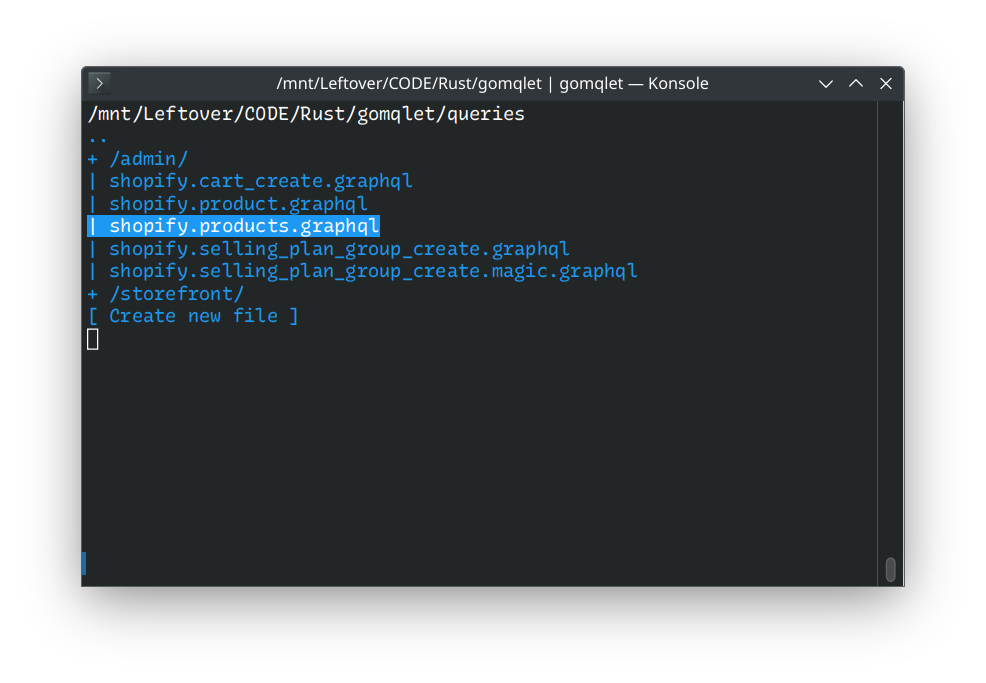

# Gomqlet

Toy graphql executor project.




Features:

- GraphQL query / mutation editor
- syntax highlight
- tokenizer + parser
- autocompletion
- (basic) error detection
- query / mutation exection (over HTTP)
- file browser
- query chaining (with result insertion)


## Use

```bash
cargo run -- -h
```


### Bindings

- `CTRL-O` and then `DIGIT` / `ALT-<DIGIT>`: apply suggestion
- `CTRL-G`: execute query
- `CTRL-C` / `CTRL-D`: quit application
- `ALT-F` / `CTRL-F`: file browser
- `ALT-S`: save file


### Magic tokens

Format: `<` + definition + `>`

Types:

- Query chaining: `query::FILE_NAME::JSON_PATH` (example: `<query::users.graphql::$.data.users.edges[0].node.name>`)
- Random string: `random_string::LENGTH` (example: `<random_string::10>`)
- Random integer: `random_integer::MIN::MAX` (example: `<random_integer::0::100>`)
- Random word: `random_word` (example: `<random_word>`)


### File browser

Only `.graphql` file types (text/plain) can be opened.


## Todo

Bug:

-

Generic:

- MacOS keyboard combos

Editor:

-

Tokenizier:

- 

Parsing:

- 

Analysis:

- only offer not yet added fields
- validation:
    - arg requirement
    - fieldset
    - fieldset emptiness
- offering field from various implementation of concrete types

File browser:

- 

GraphQL:

-

Docs:

- 