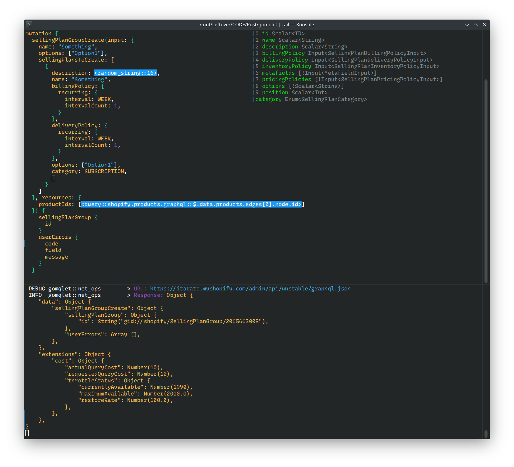

# Gomqlet

Toy graphql executor project.



Features:

- GraphQL query / mutation editor
- syntax highlight
- tokenizer + parser
- autocompletion
- (basic) error detection
- query / mutation exection (over HTTP)
- file browser

## Use

```bash
cargo run -- -h
```

Bindings:

- `CTRL-O` and then `DIGIT` / `ALT-<DIGIT>`: apply suggestion
- `CTRL-G`: execute query
- `CTRL-C`: quit application
- `ALT-F` / `CTRL-F`: file browser

## Todo

Bug:

- some suggestion shows after closing braces

Editor:

- try showing suggestions on the cursor position

Tokenizier:

-

Parsing:

-

Analysis:

- only offer not yet added fields
- validation:
    - arg requirement
    - fieldset
    - fieldset emptiness
- limit suggestion to screen size

File browser:

- 

GraphQL:

- magic tokens (eg.: random string)
